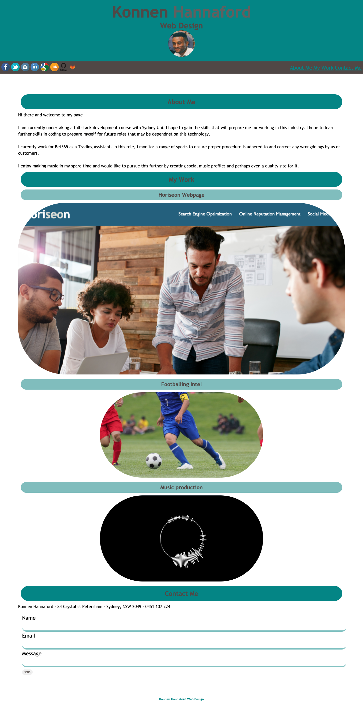

# Konnen Hannaford My portfolio

Site can be accessed here: https://konnenhannaford.github.io/my-portfolio/
Github Repo: The source can be retrieved by cloning and pulling from https://github.com/konnenhannaford/my-portfolio

# About
This page is the wesbite of Konnen Hananford - web developer. Included on the page is information about Konnen, his portfolio and a section for contact information.

# Tools used
- HTML, CSS

# Updates
- Site has been updated to inlcude links to social sites and projects
- Site has been updated to include section links at the top of the page
- Site has been updated to format to smaller screens and maintain formatting
- Coding for site has been streamlined for efficiency 
- A repo following best practice has been created 
- A ReadMe detailing the site and its workings has been created
- Site has been deployed as a live site and applications loads with no errors

# When the portfolio is loaded:
- Site shows the developer's name, a recent photo or avatar, and links to sections about them, their work, and how to contact them
- Site shows working links to other sections of the page
- Site shows working links to other pages in my portflio
- Site shows the first assignment as the larger image for my portfolio section
- Site shows a responsive laout when resized to smaller scereens

# Making Changes
- Repo is public and can be updated by all via https://konnenhannaford.github.io/my-portfolio/

# Learnings and changes
Completing this has increased familiarity with the process of creating a website, flexbox and CSS overall.  Further work needs doing for functionality, such as:
- Fixed header that allows for section links to work proerly
- A more improved visual component for design appeal
- Updated functionality to include media players
- Updated fucntionality to include javascript
- Update to include future work

# Screnshot of deployed page

